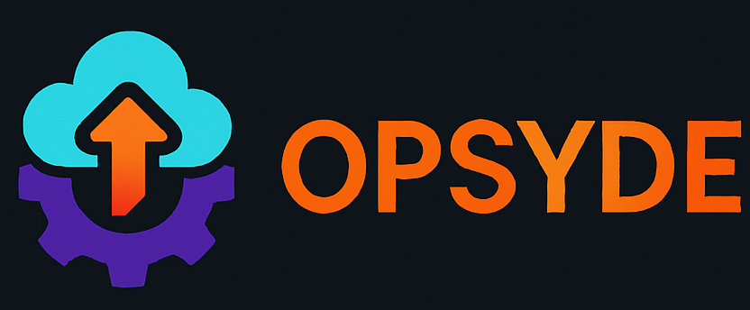
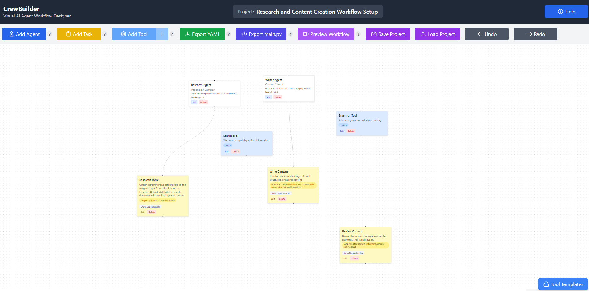
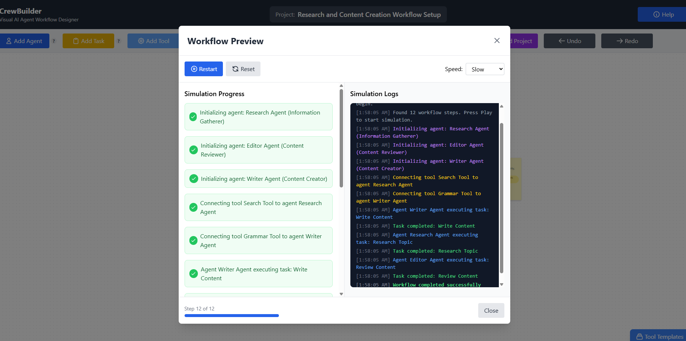
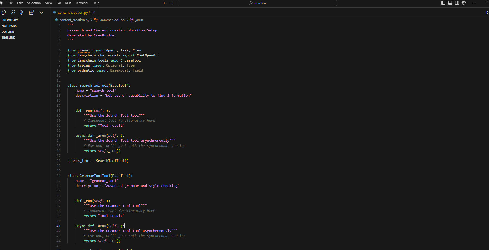

# Opsyde



## Build AI Agent Workflows Without Code

Opsyde is an open-source visual interface for designing, testing, and deploying AI agent workflows using the [CrewAI framework](https://github.com/crewAIInc/crewAI). Create complex multi-agent systems with a simple drag-and-drop interface - no coding required.

[](LICENSE)
[](https://github.com/efuet/crewbuilder/stargazers)
[](https://github.com/efuet/crewbuilder/issues)

## 🚀 Features

- **Visual Workflow Designer**: Drag-and-drop interface for creating agent workflows
- **Agent Configuration**: Define roles, goals, and capabilities for each AI agent
- **Task Management**: Create and connect tasks with dependencies
- **Tool Integration**: Extend agent capabilities with pre-built or custom tools
- **Preview Mode**: Test your workflow before deployment
- **Code Export**: Generate Python or YAML code for use with CrewAI
- **Templates**: Start with pre-built templates for common use cases
- **Support for Crews & Flows**: Design both autonomous agent crews and sequential flows

## 🖥️ Screenshots

| Design View | Preview Mode | Export Options |
|-------------|--------------|----------------|
|  |  |  |

## 🛠️ Installation

### Prerequisites
- Node.js (v16 or higher)
- npm or yarn
- CrewAI (v0.21.0 or higher) for running exported workflows

### Setup

```bash
# Clone the repository
git clone https://github.com/efuet/crewbuilder.git
cd crewbuilder

# Install dependencies
npm install
# or
yarn install

# Start the development server
npm run dev
# or
yarn dev
```

Visit http://localhost:3000 in your browser to start using CrewBuilder.

## 📖 Usage Guide

### Creating Your First Workflow
1. **Add Agents**: Click the "Add Agent" button to create AI team members
2. **Add Tasks**: Click "Add Task" to create jobs for your agents
3. **Add Tools**: (Optional) Add tools to extend agent capabilities
4. **Create Connections**:
   - Connect agents to tasks they should perform
   - Connect tools to agents that should use them
   - Connect tasks to establish dependencies
5. **Preview**: Test your workflow in preview mode
6. **Export**: Generate code to use with CrewAI

### Crews vs Flows
CrewBuilder supports both of CrewAI's workflow paradigms:
- **Crews**: Autonomous agents that collaborate with minimal supervision
- **Flows**: Sequential processes with precise control over execution order

Choose the approach that best fits your use case, or combine them for complex workflows.

### Example Workflow: Research Assistant
1. Create a "Researcher" agent with web search capabilities
2. Create a "Writer" agent for summarizing findings
3. Add tasks: "Gather Information" and "Write Summary"
4. Connect the Researcher to the "Gather Information" task
5. Connect the Writer to the "Write Summary" task
6. Create a dependency between the two tasks
7. Export as Python code

## 🧩 Components

### Agents
Agents are AI team members with specific roles and capabilities. Each agent has:
- **Role**: The specific job or function within the crew
- **Goal**: What the agent is trying to achieve
- **Backstory**: Background information that shapes the agent's approach
- **LLM Model**: The AI model powering the agent
- **Settings**: Options for delegation, verbosity, etc.

### Tasks
Tasks are specific jobs assigned to agents. They include:
- **Description**: What needs to be done
- **Expected Output**: The format and content of what should be produced
- **Execution Settings**: Synchronous or asynchronous execution
- **Dependencies**: Other tasks that must complete first

### Tools
Tools extend agent capabilities by providing access to external services or functions:
- **Web Search**: Find information online
- **Calculator**: Perform mathematical operations
- **API Tools**: Connect to external services
- **Custom Tools**: Create specialized capabilities

## 🔄 Workflow
The workflow connects agents, tasks, and tools to solve complex problems collaboratively:
- **Agent → Task**: Assigns a task to an agent
- **Tool → Agent**: Gives an agent access to a tool
- **Task → Task**: Creates a dependency between tasks

## 📤 Export Options
CrewBuilder generates code that can be used with the CrewAI framework:

### Python
```python
from crewai import Agent, Task, Crew
from langchain.chat_models import ChatOpenAI

# Agents
researcher = Agent(
    role="Researcher",
    goal="Find accurate information",
    backstory="Experienced researcher with attention to detail",
    verbose=True
)

# Tasks
research_task = Task(
    description="Research the topic",
    expected_output="Comprehensive report",
    agent=researcher
)

# Create the crew
crew = Crew(
    agents=[researcher],
    tasks=[research_task],
    verbose=True
)
result = crew.kickoff()
```

### YAML
```yaml
crew:
  name: Research Crew
  description: A crew for researching topics
  agents:
    - name: researcher
      role: Researcher
      goal: Find accurate information
      backstory: Experienced researcher with attention to detail
      verbose: true
  tasks:
    - name: research_task
      description: Research the topic
      expected_output: Comprehensive report
      agent: researcher
```

## 🤝 Contributing

Contributions are welcome! Please feel free to submit a Pull Request.

1. Fork the repository
2. Create your feature branch (`git checkout -b feature/amazing-feature`)
3. Commit your changes (`git commit -m 'Add some amazing feature'`)
4. Push to the branch (`git push origin feature/amazing-feature`)
5. Open a Pull Request

Please read [CONTRIBUTING.md](CONTRIBUTING.md) for details on our code of conduct and the process for submitting pull requests.

## 📚 Resources

- [CrewAI Documentation](https://github.com/crewAIInc/crewAI)
- [CrewAI Learning Portal](https://learn.crewai.com)
- [CrewAI Discord Community](https://discord.gg/X4JWnZnxPb)
- [Example Projects](https://github.com/crewAIInc/crewAI/tree/main/examples)

## 📝 License

This project is licensed under the MIT License - see the [LICENSE](LICENSE) file for details.

## 🙏 Acknowledgments

- [CrewAI](https://github.com/crewAIInc/crewAI) for the underlying framework
- [React Flow](https://reactflow.dev/) for the flow-based UI components
- All contributors who have helped shape this project

---

<p align="center">
  Made with ❤️ by the OpSyde team
</p>

# CrewBuilder Frontend

The frontend application for CrewBuilder, built with React and ReactFlow.

## Overview

This frontend provides a visual interface for designing AI agent workflows. It allows users to:
- Create and connect different types of nodes (agents, tasks, tools)
- Configure node properties through a user-friendly interface
- Run workflows and view execution results in real-time
- Export workflows and results in various formats

## Key Components

- **BuilderPage**: Main workflow editor page
- **FlowCanvas**: ReactFlow canvas for the node editor
- **NodeTypes**: Custom node components for agents, tasks, and tools
- **Panels**: UI panels for templates, help, and execution results

## Development

### Prerequisites

- Node.js (v14+)
- npm or yarn

### Installation

```bash
# Clone the repository
git clone https://github.com/efuet/crewbuilder.git
cd crewbuilder

# Install dependencies
npm install
# or
yarn install

# Start the development server
npm run dev
# or
yarn dev
```

### Running the Development Server

```
npm
